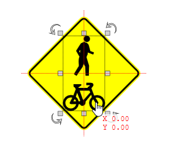

---

sidebar_position: 30

---
# Snap to Bounds selection

When moving or scaling objects and print regions, their bounds edges and centers snap to each other for quick and precise positioning.

This can be particularly useful when trying to align objects to Print region borders or when creating custom signs, see Figure 5.17 below

The bound edges or centers will be indicated by a red dotted line.

**NOTE**: Use F3 to quickly toggle snapping on/off.

