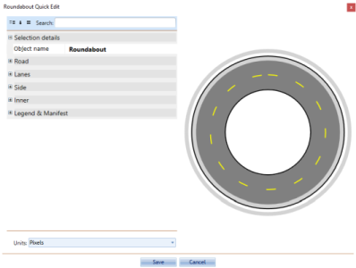

---

sidebar_position: 10

---
# View or Edit an Object's Properties

 1. As discussed previously, you can edit properties from the properties palette or using quick edit mode. Double click on the object you wish to inspect to open the Quick Edit box. The object's properties screen will appear. Note that the properties will be different for each object type.

    

1.Make any necessary adjustments to the settings.
2.The Preview window will show you any adjustments you've made. Press Ok to complete your changes.
