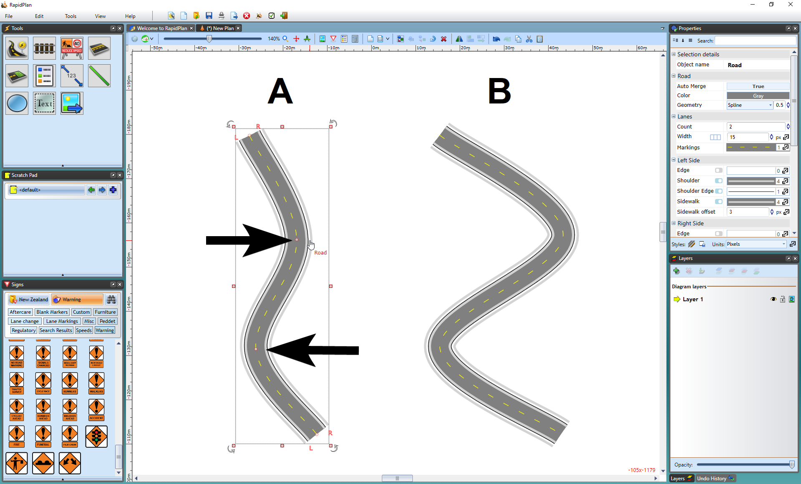

## Editing the Shape of an Existing Road

Like any other object in RapidPlan, the shape of the road once drawn can very easily be edited by shifting it's control points.

**To edit the roads shape:**

 - Select the road by clicking on it once. This will make its control
   points visible.
 - Drag any of the control points until the road is the correct shape.
 - Remember that you can hold **SHIFT** to make the control points line up in a row.

In the image below, Road A is the original road. Road B has had the 2nd and 3rd control points adjusted to change the shape of the road.

