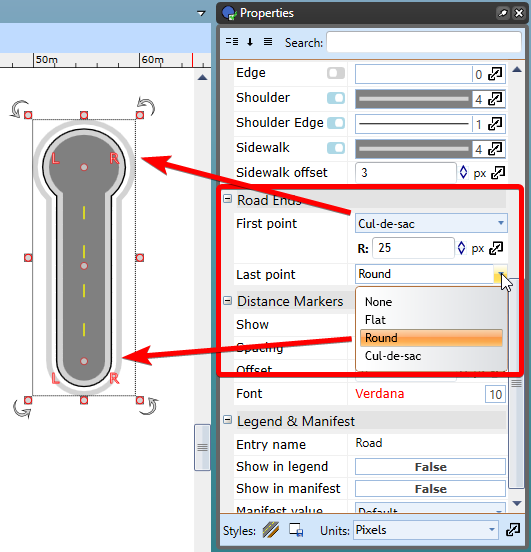

## Inserting Road Ends 

There will be occasions where you need to insert a road end or a dead-end road. To do this we simply make a road and change its properties as seen in Figure 6.6.

You can select from flat, round or cul-de-sac. You can adjust sizing and control point of inserted road end.
