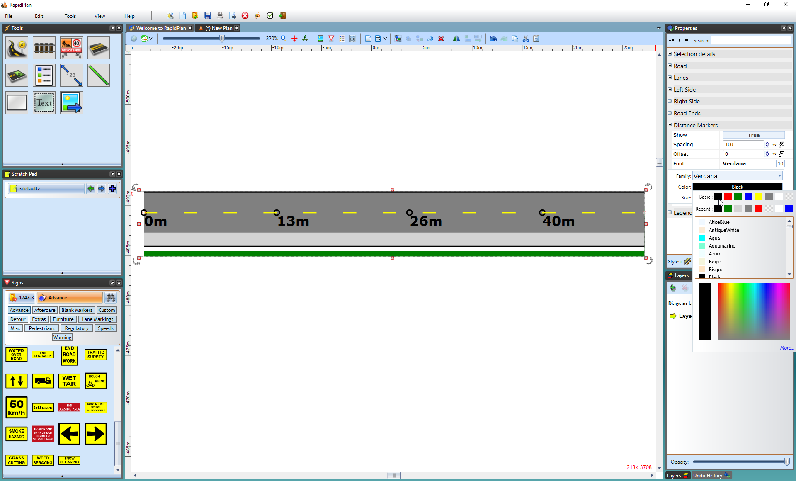

## Distance Markers

This section allows you to activate distance markers on the road. On the image below, you can see the distance markers have been set to **True** and are visible on the road, also font color changed to black.

**To activate Distance Markers on a road:**

 - Select the road.
 - On the **Distance Markers** section of the properties palette click **False** in the **Show** section to change it to **True**.

    