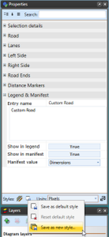
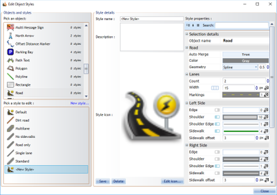

## Setting a Default Road Style 

Some users with special needs will not want their roads drawn in the factory default format. Therefore, you can configure a different default road style. You can set a default for any or all of the properties described above.

**To set the road defaults:**

 - From the Properties palette, select all of the properties settings to the desired default settings you would like.
 - At the base of the palette select the **Save object style** > **Save as default style** or **Save as new style**.

    

    