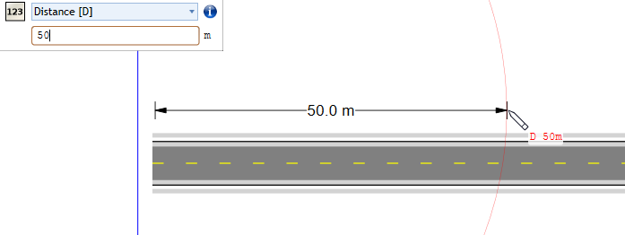

---

sidebar_position: 11

---
# Dimension Input Panel

Start typing at any time while drawing objects to specify precise distance, angle, offset, point or coordinates for the next point. Pixels or site distance units can be used (for plans drawn to scale). 

Simply click out the first point of your distance marker, start typing your measurement and the dimension input panel will display, hit enter and it will give you an exact measurement based on your input. Then hit enter again to confirm the measurement

 	