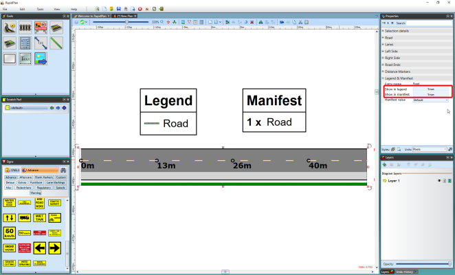

---

sidebar_position: 9

---
# Properties of the Road Tool - Legend and Manifest

By default, roads are not included in **Legend** and **Manifest**. To change this you to activate the road object on a **Legend & Manifest** section. 

There you can also choose the manifest value as **Default** or **Dimensions** and set custom **Entry name** (see the image below)

**To activate road on your plan's legend and/or manifest:**

 - Select object.
 - On the **Legend & Manifest** section of the properties palette clock on **False** on **Show in legend** section to make it **True**.

    

    
    
    **Note that this function is in the properties of all objects in RapidPlan**