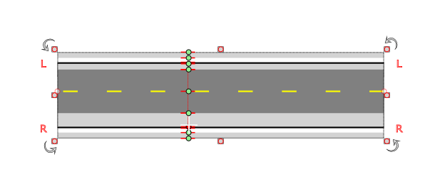

---

sidebar_position: 3

---
# Manipulating Road Elements using Width Handles

There will be times when you need to adjust road, sidewalk or shoulder widths. Rather than going to the road properties you can adjust them on the road itself.

To enable the handles, simply select a road and hold CTRL + H. This will bring up adjustable road width handles as seen below.

 
