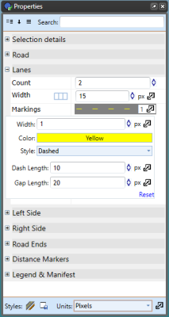
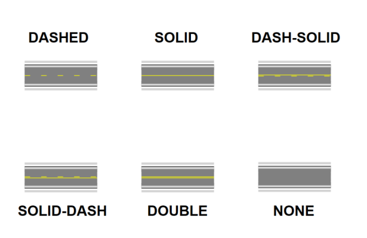

---

sidebar_position: 6

---
# Properties of the Road Tool - Lanes 

In this section you can edit the number of lanes, lane width and lane markings (including width color and style).

**To change a road's lane markings in properties:**

 - Select the road.
 - On the Lanes tab in the properties palette select Markings.
 - Change the width value, the color and/or style of the markings (Dashed, Solid, DashSolid, SolidDash, Double or None), dash and gap length.

Styles of Lane Markings for your roads:

Each line marking on a road is set individually, so you can have different markings for different lanes. Each extra lane you add will accessible in the Markings section.