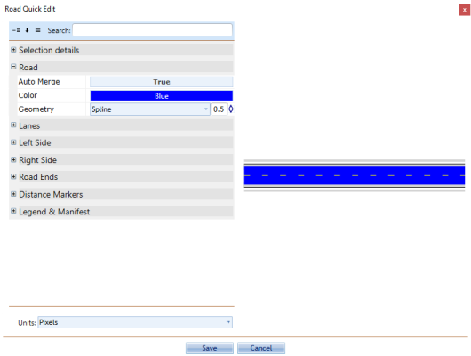
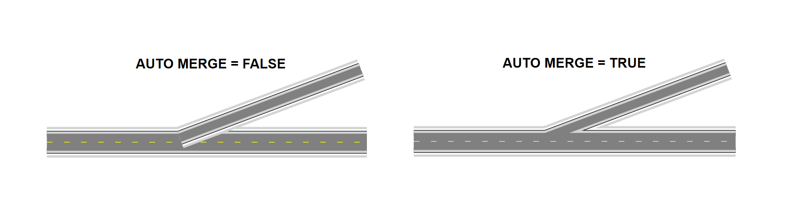

---

sidebar_position: 5

---
# Properties of the Road Tool - Road 

The Road section of the road's properties allows you to adjust the color, the road geometry (Spline, Line or Bezier) and auto merge preferences.

**To change the color of the road in the properties palette:**

 - Select the road on your plan
 - Select the **Road** section on the properties palette
 - Select the **Color** bar (the blue bar the image below)
 - Some color options will become available for you to choose from

    

The **auto merge** feature controls whether a new road will automatically merge with the selected road. As shown below, when set to **True** it means the new road will automatically merge, **False** means it will not.

