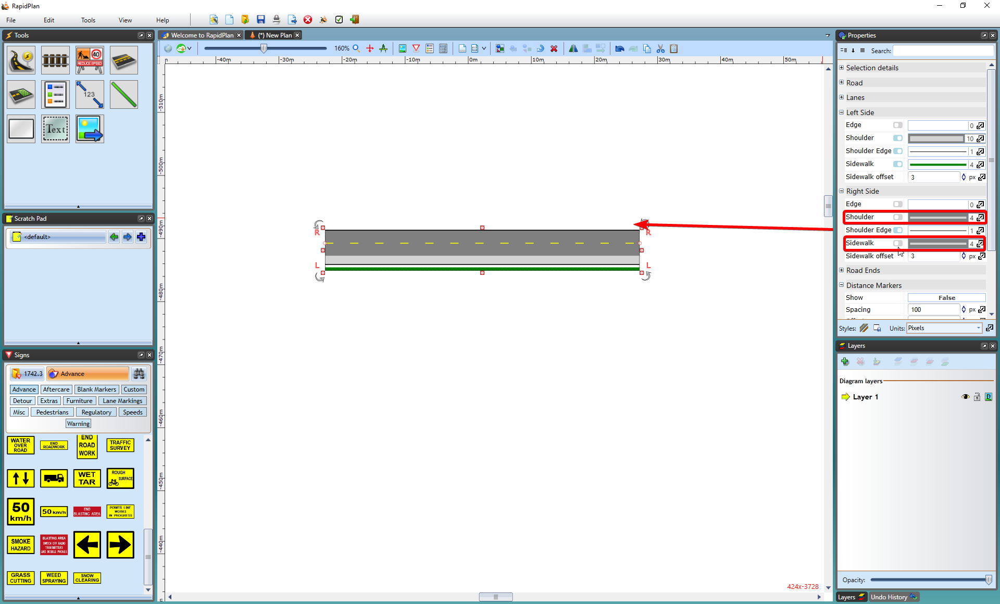

---

sidebar_position: 7

---
# Properties of the Road Tool - Sides of the Road

By default, each road is drawn with both a left and right edge line shoulder and sidewalk. You can set the width of the shoulders and sidewalks, or choose to turn them off completely. The left and right sides can be configured individually, and as such do not need to be the same in appearance.

In this section you can adjust the left/right edges (color, width), shoulders (width, color, shoulder edge) and sidewalks (width, color, offset).

**To change Left Side (or Right Side) shoulder properties:**

- Select the road.
- On the **Left Side/Right Side** section of the properties palette select **Shoulder** to adjust the width and color of the Left Shoulder (see the image below).

    **Note**: The Edges and Sidewalks can be adjusted in a similar way.

    

**To turn a edge/shoulder/sidewalk on or off:**

- Select the road.
- On the Left Side/Right Side section use the check boxes to toggle the on/off state of the properties as shown below.

    
