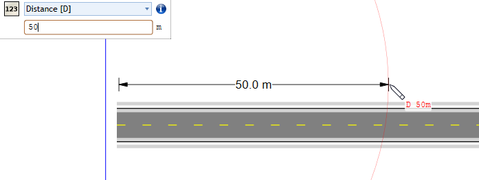

---

sidebar_position: 11

---
# The Magic Accuracy Tool (name review pending)

The MAT tool allows you to:
-**Distance [D]**: Place a control point an exact distance from the last.
-**Angle [A]**: Place a control point at an absolute angle, or at a chosen angle compared to the last two points.
-**Offset [O]**: Offset something (//fix this) .
-**Point [P]**: Place an object or control point at a chosen location on your plan relative to the plan's centerpoint.
-**Coordinates [C]**: Or place an object or control point at a given coordinate (latitude/longitude).

Each of these can be engaged by clicking the corresponding key on your keyboard while you are drawing or placing an object.

Once a suitable key is clicked while drawing or placing an object, a small window will appear in the top-left of your canvas. Here you will be able to input the value related to your desired result. You may also switch between MAT tools as needed.

## Distance [D]

Once you have placed at least one control point for an object you can click 'D' on your keyboard, enter a value in the textbox and click Enter.

A red circle will appear around the last point, locking in the chosen distance for your next control point placement.

If you need this tool again for your next point, simply click 'D' again and repeat.

If you decide against using the distance tool once the red circle has already been engaged, click **Esc** to cancel.

## Angle [A]

 
