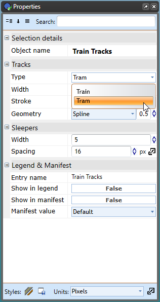

## The Train Tracks

The Train Tracks tool allows you to quickly add train or tram (light rail) lines to your plan.

**To place a train line:**

 - Select the **Train Tracks** tool from the Infrastructure tab in the Tools Palette
 - Click once to start your rail line.
 - Click at each turn point.
 - Right click to stop drawing.

    

To place a tram line on **Properties palette** change **Type** value from **Train** to **Tram** {.page-break-before}

