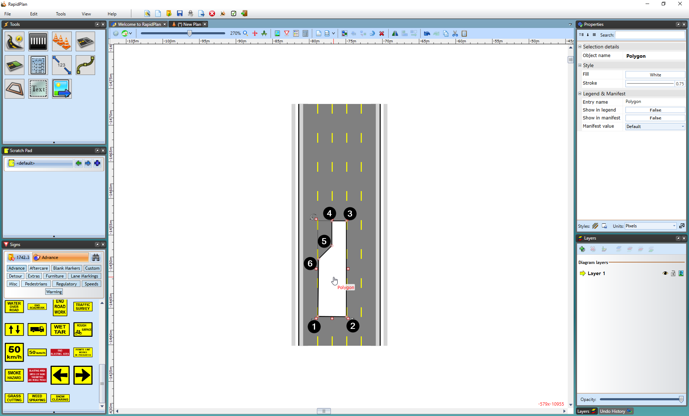

## Islands with the Polygon

Creating islands with the polygon is as simple as tracing out the shape of your island on your road. This is the easier of the two methods.

**To create an island with the polygon:**

 - Select the **Polygon** tool from the Shapes tab in the tools palette
 - It is best to start your island at one of its corners. Click once to start drawing
 - Move in either a clockwise, or anti-clockwise order, clicking at each of your island's corner points (**Note**: Remember, you can hold **SHIFT** to keep the corners of your island perfectly straight)
 - When you have placed your last point, right click to stop drawing, and then right click to drop the Polygon tool

    

The picture above shows an example of a click sequence to create an island. Polygon is a free form tool, you can make islands of virtually any shape.
