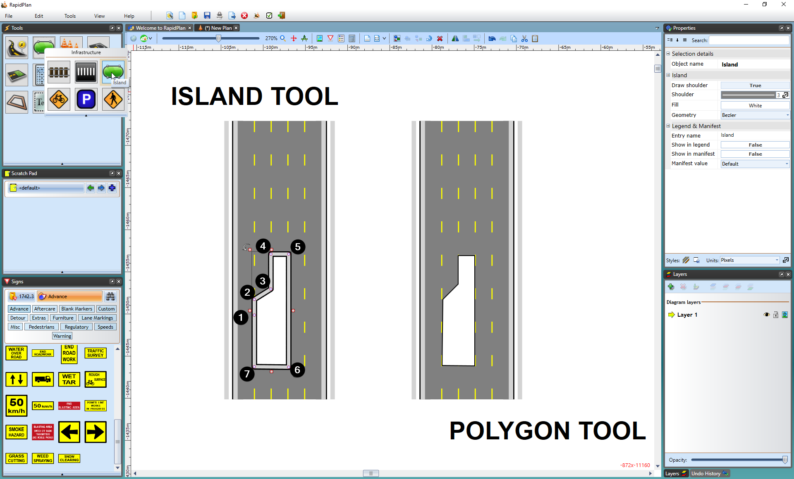
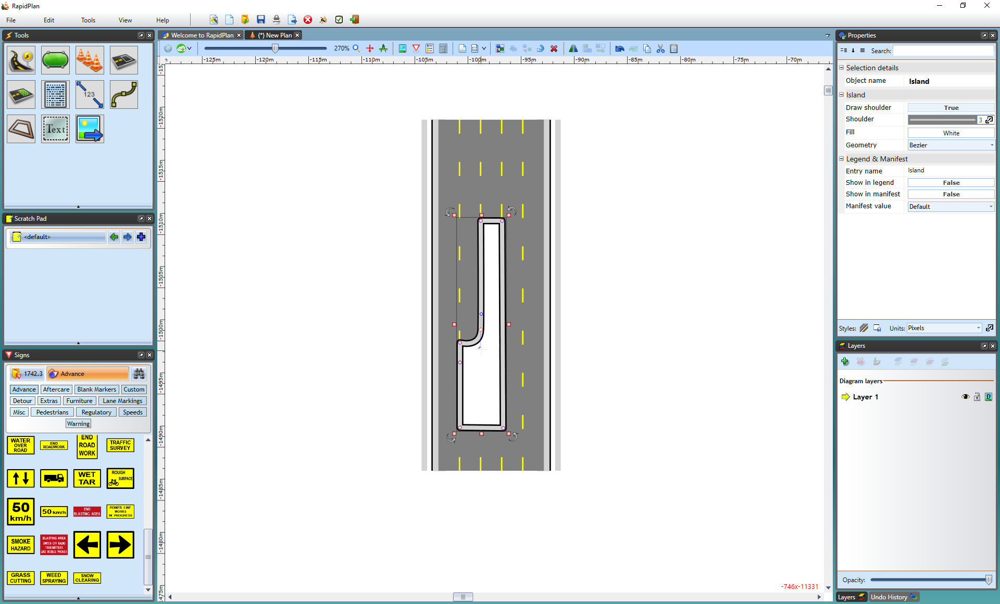

## Islands with the Island Tool

In many aspects, creating islands with the Island Tool is the same as using the polygon. This is because the Island Tool is just a special kind of polygon. The difference between the two is that the Island has shoulders that match the road.

This is definitely an advanced tool and will take some practice to master.

**To create an island with the island tool:**

 - Select the **Island** tool from the Infrastructure tab in the tools palette
 - Start your island at the smallest corner, click once to start drawing
 - Move in either a clockwise, or anti-clockwise order, clicking at each of your island's corner points (**Note**: Remember, you can hold **SHIFT** to keep the corners of your island perfectly straight)
 - When you have placed your last point, right click to stop drawing, and then right click to drop the Island tool

    

There are two main differences between using the polygon and Island tool:

 1. A different start point - Unlike the polygon, you should never start your island on a steep corner point (anything greater than about 45 degrees). This is because it can cause the shoulder lines to cross over.
 2. The Island Tool can be curved - By using a special technique, the control points for the island can curved, allowing you to make perfectly accurate reproductions of what is actually on the road.

The technique for creating control points is simple but requires some practice.

**To create a curved island:**

 - Draw your island as normal
 - Ensure your cursor is clear of the Island Tool by right clicking
 - Now select the Island that you've drawn by clicking on it once
 - Move your cursor over the control point that you wish to curve and hold down the **CTRL** button on the keyboard. The control points will then turn from red to blue and display curve handles
 - Drag the curve handles out (away from the control point) to increase the radius of the curve until you are happy with the islands shape

    
