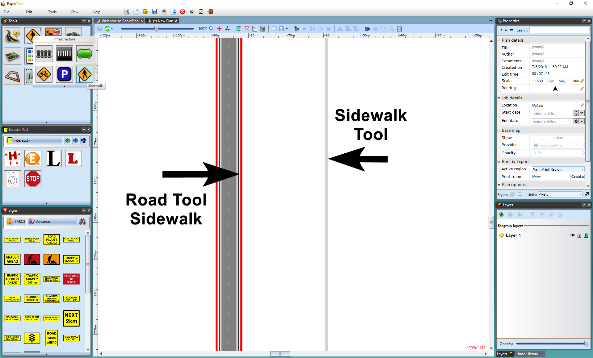

## The Sidewalk Tool 

The **Sidewalk** tool is used like any **Polyline** tool. In the example below, you can see that the Road tool's sidewalk and the Sidewalk tool's sidewalk are visually the same, however, you have more control over the Sidewalk tool as it is an individual item, such as putting a sidewalk through a grassy patch like in the example below.

