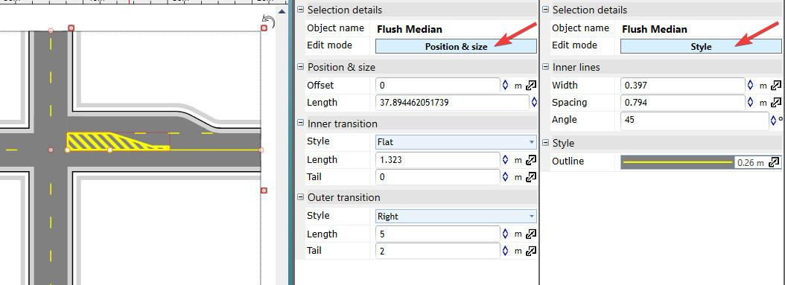
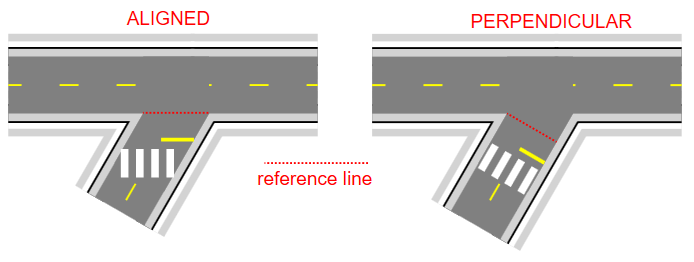

##  Editing element and positioning styles 

When an element is selected, it displays a draggable Offset point. You can drag the point to position the element along the road it was added to (Offset = 0 represents the position at which the road meets the other roads forming the intersection). For Turn Lanes, the point allows adjusting the lane length, and for Road Corners - the corner radius. Some elements (Lane Markers, Flush Medians) present two points - for adjusting the Offset and the Length of the element.

NOTE: since the Offset value is relative to the intersection, changing the layout of roads forming the intersection will automatically adjust all intersection elements.

Other than dragging the points, you can also provide specific values for Offset, Length of selected intersection elements in the Properties panel. The Properties grid also contain some more advanced settings (see the set of properties for a Flush Median element below), allowing you to draw medians with different transitions and tails. Note the "Edit mode" button - for elements that have editable styles, clicking it exposes the dedicated style properties instead of positioning ones.

  

One property that requires an additional comment is Position & size -> Orientation that determines the reference line used when calculating object position for the current Offset value. The orientation can either be Aligned (with the line connecting the points where the road meets its left and right neighbors) or Perpendicular (to the road itself). For roads meeting at right angles these modes will produce identical results, but for some other road layouts it'll be important to understand the difference in order to achieve the desired positioning, particularly for objects stretching across the road, like the crosswalk or stop lines. The difference between the two modes is presented below:

 