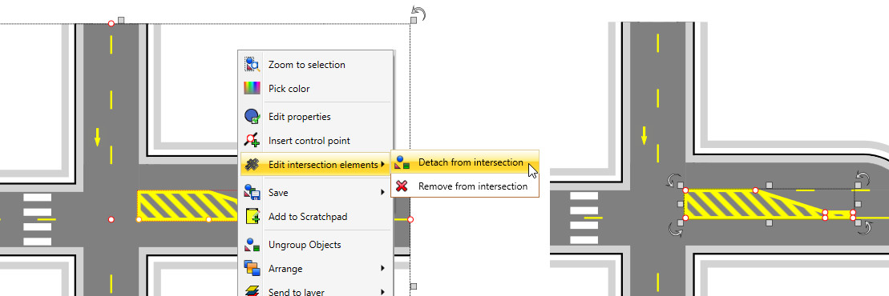

## Ungrouping intersections   
 

The intersection editor is designed to assist in drawing typical intersections. If any additional adjustments are required for more complex intersection layouts, an intersection can be ungrouped, allowing all its elements to be freely edited (ungrouped elements become regular plan objects, exposing adjustable control points and properties). To ungroup, simply select an intersection and hit Ctrl+U.

Sometimes, instead of ungrouping the whole object, you might want to detach a specific element from the intersection. To achieve this, select one or more elements, right-click and select Edit intersection elements -> Detach from intersection. This will remove the elements from the intersection and replace them with identical object added directly to the plan. See an example below:

