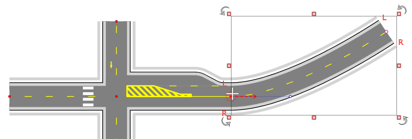

## Connecting incoming roads 

The intersection object exposes control points at the end of each of its roads. These points can be snapped to when drawing a road object or adjusting control points of an existing road. Holding down the Ctrl key while snapping to intersection enables automatic road alignment - RapidPlan will automatically adjust the shape of the road so that it seamlessly merges with the intersection object.

 