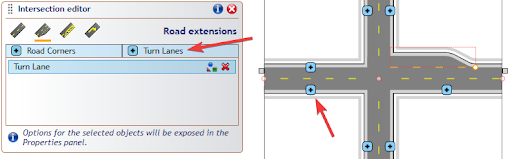
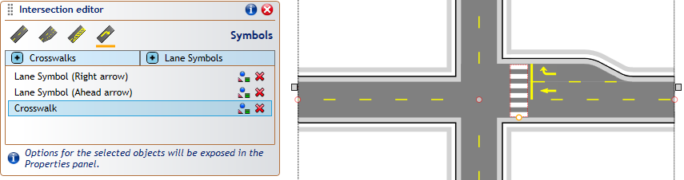

---

sidebar_position: 22

---
# Adding and selecting intersection elements

Note the 4 icons at the top of the Intersection Editor panel - these can be used to switch between the available editor modes:

-   Road properties - adding and editing incoming roads,
    
-   Road extensions - road corners and turn lanes,
    
-   Markings - lane markers, stop lines and flush medians,
    
-   Symbols - crosswalks and lane symbols.
    

To add an intersection element, switch to the required category and click one of the add [+] buttons in the panel. This will decorate the intersection with additional [+] buttons showing places where this type of element can be added. The sample below shows the process for adding a turn lane:

 

Once an intersection element is added, it appears on the elements list in its category. You can select an intersection element directly from the list, or by holding the Ctrl+Alt keys and clicking on the required element of the intersection object. The selected element gets highlighted with a red outline. TIP: to select more than one element hold the Ctrl key when selecting from the editor list, or Ctrl+Alt+Shift when clicking on the intersection object.  

 