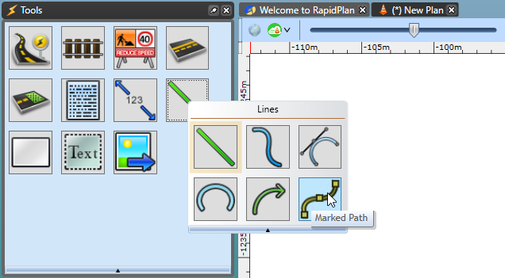
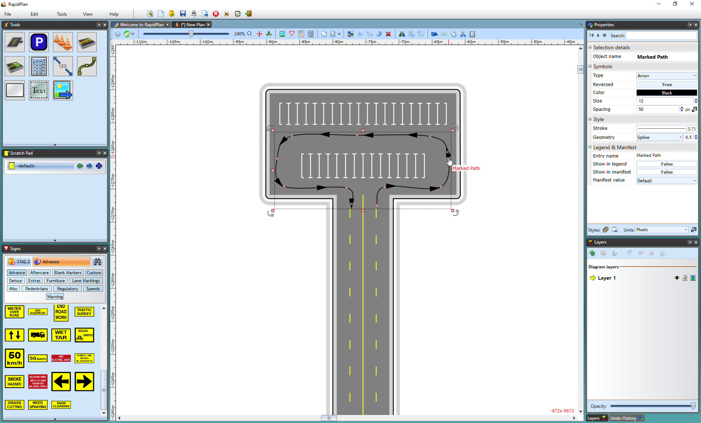

---

sidebar_position: 12

---
# Marked Path Tool 

By using the marked path tool you can outline the way a direction of traffic will flow in a clear and easy to read visual.

The tool works like any of the other road, line tools, etc., just click to mark each turning point of the arrows to make out direction of traffic as seen below.

