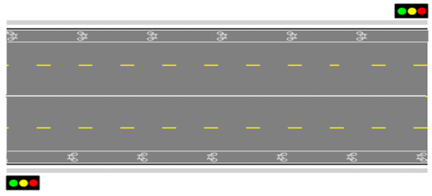

---

sidebar_position: 17

---
# The Bicycle Lane Tool 

The Bike Lane tool works similarly to tools like the Polyline and the Road tool. The bike image can be changed from a Standard (as shown below) to a Shared lane symbol in Properties.

**To place the bike lane:**

 - Select the **Bike Lane** tool from the Infrastructure tab in the Tools Palette.
 - Click to start the bike lane.
 - Hold **SHIFT** to create a straight lane, or click to create control points to adjust the lane's shape.
 - Right click to finish.
