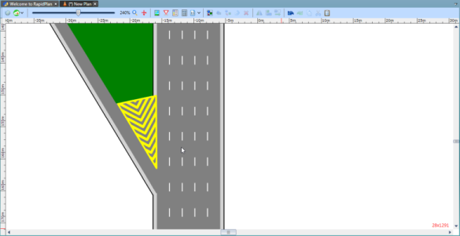

---

sidebar_position: 11

---
# The Chevron Flush Median Tool

This tool also works like a polygon, with the first click forming the tip of the chevron.

**To place the chevron flush median tool:**

 - Select the Chevron Flush Median tool from the Markings tab in the Tools Palette
 - Your first click will be the top point of the shape (in the direction of the chevron)
 - Then click for all other consecutive points
 - Right click to finish

    
