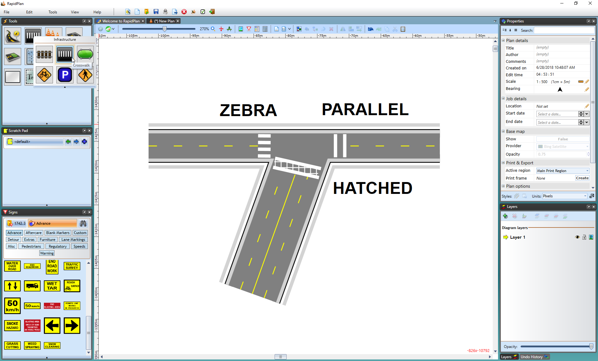

---

sidebar_position: 15

---
# The Crosswalk

The Crosswalk tool is a handy tool that creates crosswalks on roads, arcs, and roundabouts. There are a few options available when editing the crosswalk. You can change the crosswalk width and type to parallel or hatched. The stripe width and spacing can also be changed to accommodate your specifications.

**To create a crosswalk:**

- Draw your road
- Select the **Crosswalk** tool from the Infrastructure tab in the Tools palette
- Place your cursor where you want the crosswalk to start and left click your mouse once to start drawing
- Right click to finish drawing

    

Three different types of crosswalks have been created in the screen print above. Crosswalk type can be changed on the Properties palette.
