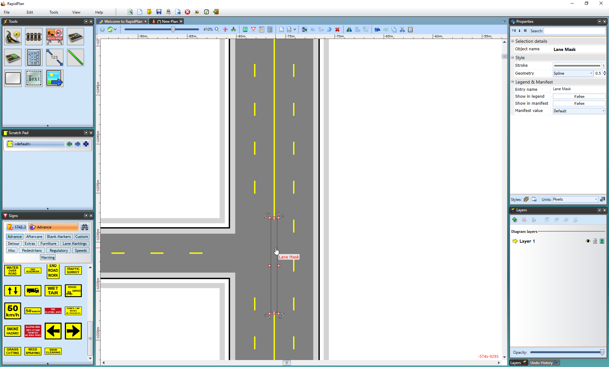

---

sidebar_position: 7

---
# The Lane Mask tool

Sometimes, it may be necessary to remove a small section of a lane marking on a road. This is often the case when building intersections. You can remove a small section of lane marking by using the Lane Mask tool. It's located within the Tools palette in the Markings tab.

**To mask out a lane marking:**

 - Hover your cursor over **Markings** in the Tools palette
 - Select the **Lane Mask** tool 
 - Click and hold the left mouse button on the marking, at the point you wish to start the mask
 - Move the mouse along the line to lay out the mask
 - On curves, you will need to click in turn points for your mask as it follows the road
 - Right click to finish

    

The lane mask tool is no different to any other object in RapidPlan once it's been placed, you can select it and shift its control points if you didn't manage to completely cover the line in the first attempt.