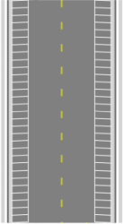

---

sidebar_position: 18

---
# The Parking Bay Tool

This tool makes it simple to add parking bays to your plan. In the items Properties Palette you have a selection of Parking styles. As you can see below, they include sides & corners, full, sides, and corners.

|Parking Bay type options                   |Parking Bays along a road                      |
|:-----------------------------------------:|:---------------------------------------------:|
||   |

**To place a parking bay:**

 - Select the **Parking Bay** tool from the Infrastructure tab in the Tools Palette.
 - Click at the first corner and drag out a line (hold **SHIFT** to keep straight).
 - Click again to make the second corner then drag the parking bays out to make their full shape.
 - Click a third time to complete it, and Right click to finish.
