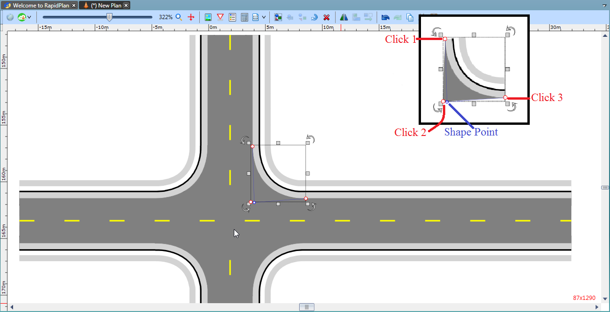

---

sidebar_position: 4

---
# The Road Corner Tool

This tool allows you to easily create road corners for your roads. It is controlled by three control points to assist in the shape and positioning of the object and a single shape point that controls the shape of the curve.

**To create a road corner:**

- Select the **Road Corner** tool from the Roads tab in the Tools Palette
- Place your first click where you want your corner to begin
- The second click places the inner corner of the object
- The third click places the final corner
- The final click positions the shape point.
- As mentioned, there are three control points and shape point to help you adjust the object

