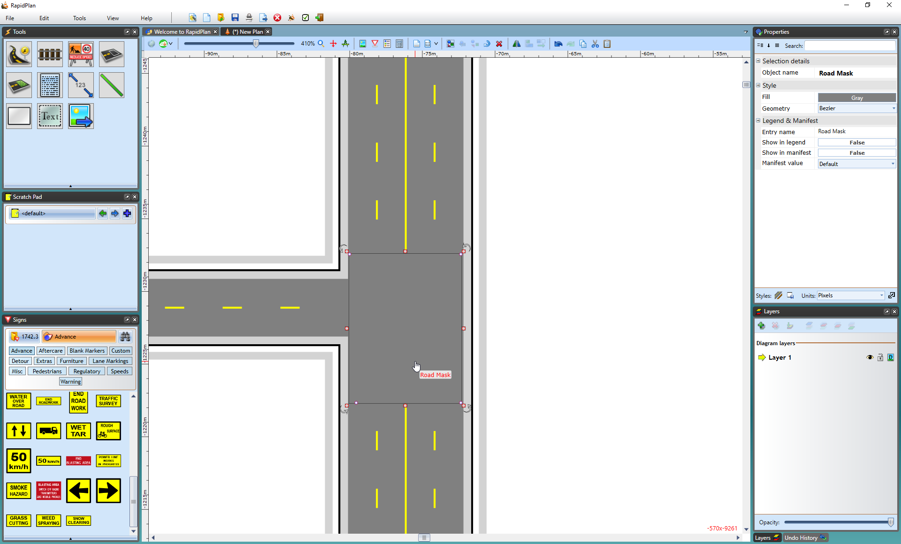

---

sidebar_position: 8

---
# The Road Mask Tool 

This tool operates similar to the Lane Mask tool and removes sections of lane markers but instead of covering only a lane width, you can cover an entire road to remove markers. This comes in handy particularly when you have several lanes on roads that meet at an intersecting point and you need to remove many lane markers.

**To mask out lane markings using the Road Mask Tool:**

 - Hover your cursor over **Markings** in the Tools palette.
 - Select the **Road Mask** tool.
 - Start using the tool as you would use the Polygon tool drawing a perimeter of the road mask enclosing all the lane markers you want.
 - Right click to finish.

    

Again, there are control points and resize handles to allow you to adjust the shape and size of the road mask. 

