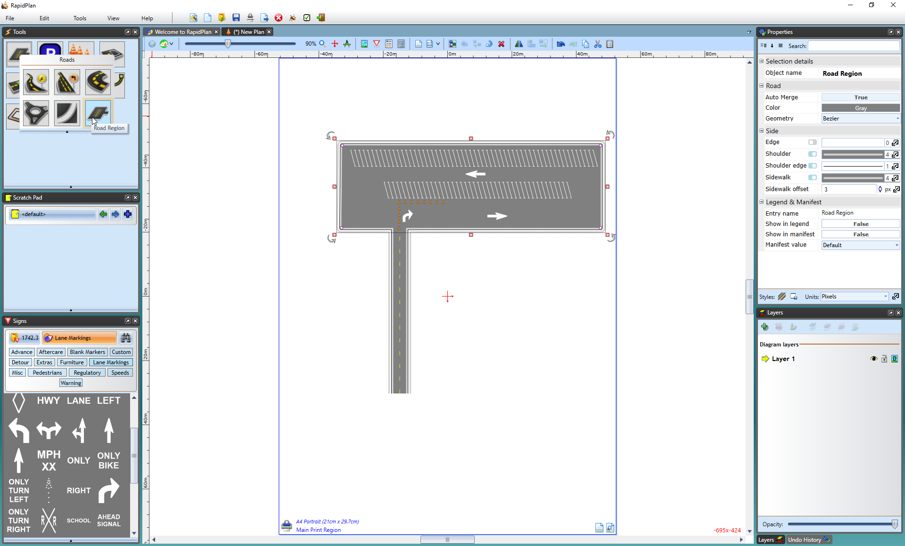

---

sidebar_position: 5

---
# The Road Region tool

The Road Region tool is **free form** road tool which you can use to draw irregular paved surfaces, like parking lots.

**To create a road region:**

- Select **Road Region** tool from Roads tab in the Tools Palette.
- Start your region at the smallest corner and click once to start drawing.
- Move in either a clockwise, or anti-clockwise order, clicking at each of your region's corner points (**Note:** Remember, you can hold **SHIFT** to keep the corners of your region perfectly straight).
- When you have placed your last point, right click to stop drawing, and then right click to drop the Road Region tool.

