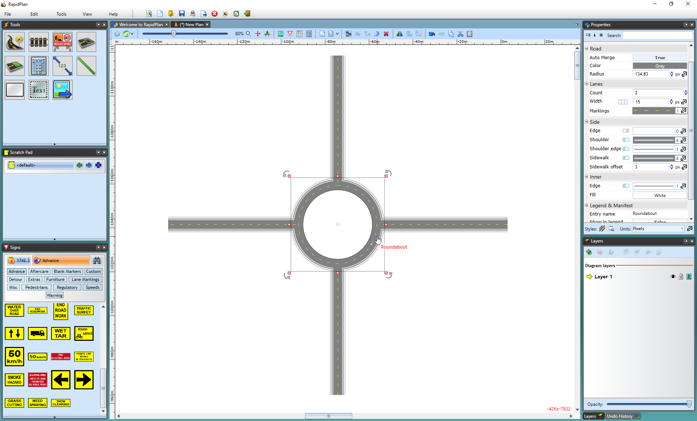

---

sidebar_position: 3

---
# The Roundabout Tool

The Roundabout tool is relatively simple to use and blends easily like other road tools.

**To Create a Roundabout:**

- Select the **Roundabout** tool in the Roads tab of the Tools palette
- Click once to place the roundabout, this is going to be a center of your roundabout
- Shift your mouse up or down to make the roundabout bigger or smaller
- Right click to finish

    
