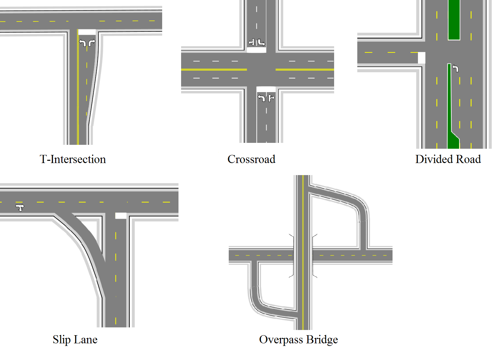

## What this Section Covers

We will be creating five different intersections of increasing complexity. In order to present as much information as possible in the shortest space, this chapter will assume that you have all of the required knowledge from previous Chapters. 

The process is fully mapped out in a step-by-step fashion, but not in so much detail as previously in this manual. Generally, we won't be showing you the forms changed throughout the process, just the screenshots of the road in progress.

The intersections this chapter will cover:

