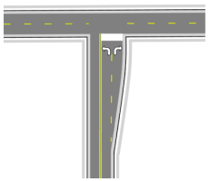

## T-Intersections 

T-intersections are the easiest of intersections to create in RapidPlan because the **Roads** tools make the task of joining roads at angles simple.

|T-intersection                                     |                            |
|---------------------------------------------------|----------------------------|
|  | **This simple T-intersection makes use if the following items:** - Road tool  - Turn Lane tool  - Lane Marker tool  - Lane Mask tool  - Rectangle tool  - Furniture from Signs Palette  |
