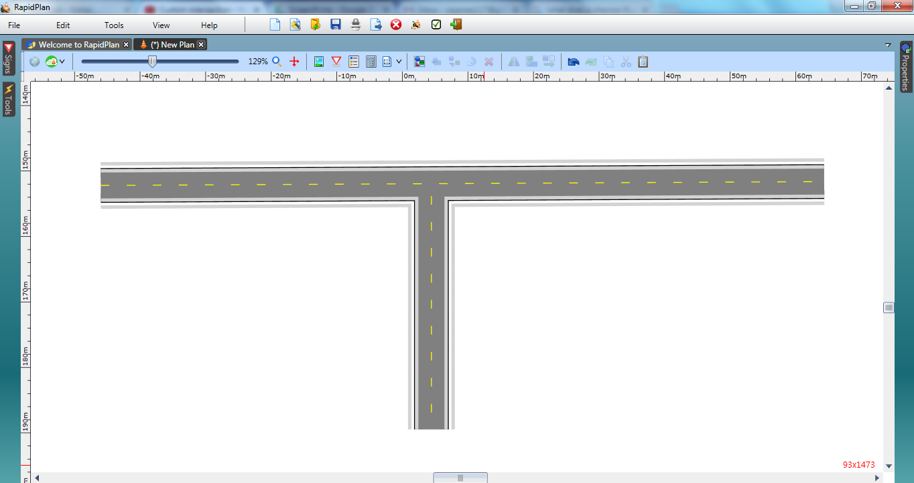
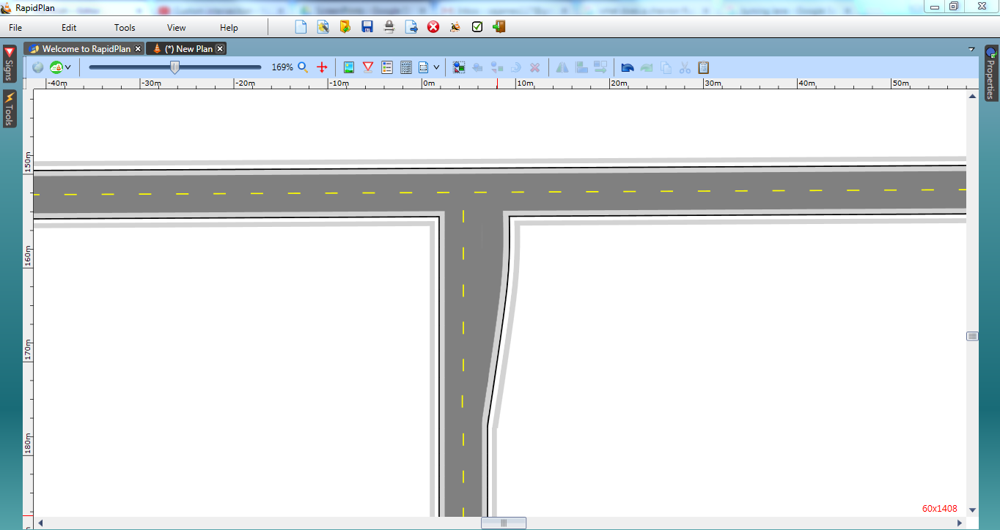

## Create the Base Roads

 1. Select the **Road** tool from the Roads tab in the Tools Palette and create an east-west road of two lanes.
 2. Add a north-south road of two lanes as shown.

    

1. Select the **Turn Lane** tool in the Roads tab of the Tools Palette and place it next to the right lane of the north-south road.
2. Click once to begin drawing the Turn Lane, click again mid-way to create the curve in the lane and click once more where the lane intersects the east-west road.

    