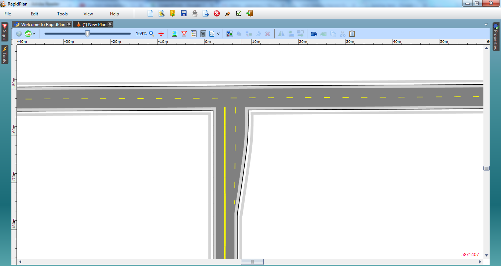

## Changing the Lane Markers

5. Select the **Lane Marker** tool in the Markings tab and draw a lane marking for the turning lane.
6. Now double click on the north-south road, select the Lanes tab and change the lane marker to double in the Markings section.

    
