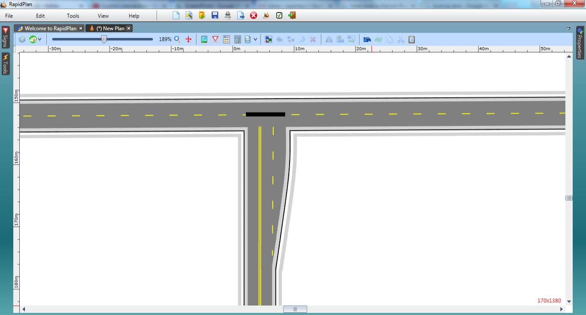

## Configuring the Road Markings 

7. With the **Lane Mask** tool, mask out the broken line on the east west road across the intersection. (To make this clearer, we have drawn the lane mask in Black for this tutorial).

    