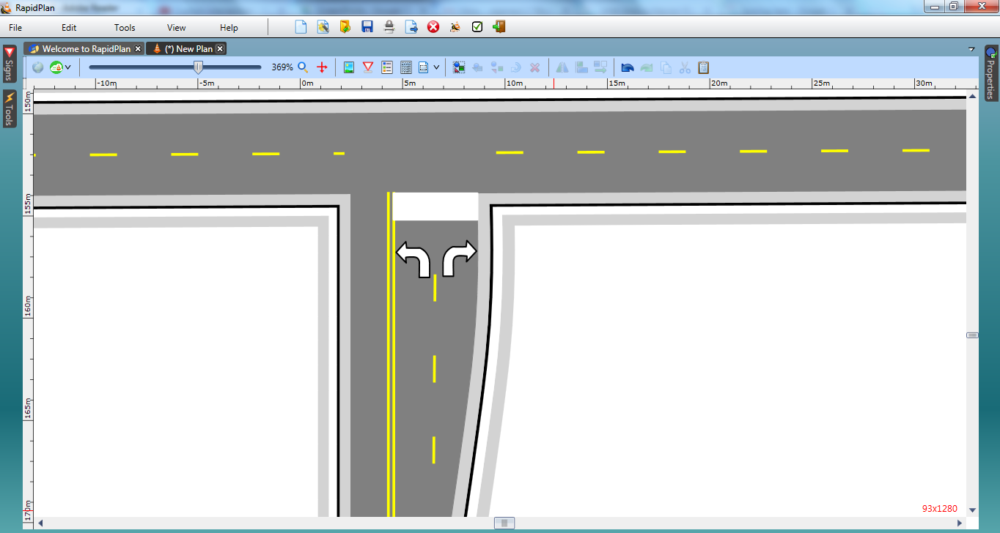

## Adding the Stop Bar and Turning Arrows

8. Select the **Rectangle** tool from the Shapes tab in the Tools Palette and draw a rectangle for a stop bar. It pays to zoom right in when doing this.
9. Double click on your drawn rectangle and change the **Stroke** color to white.

    

10. Select a **turn arrow** from the Furniture tab located within the Signs Palette and place it in the left lane. Select another and place it in the other northbound lane. You will need to flip this one horizontally using the flip function on the Flip toolbar as shown.{.page-break-before}

    