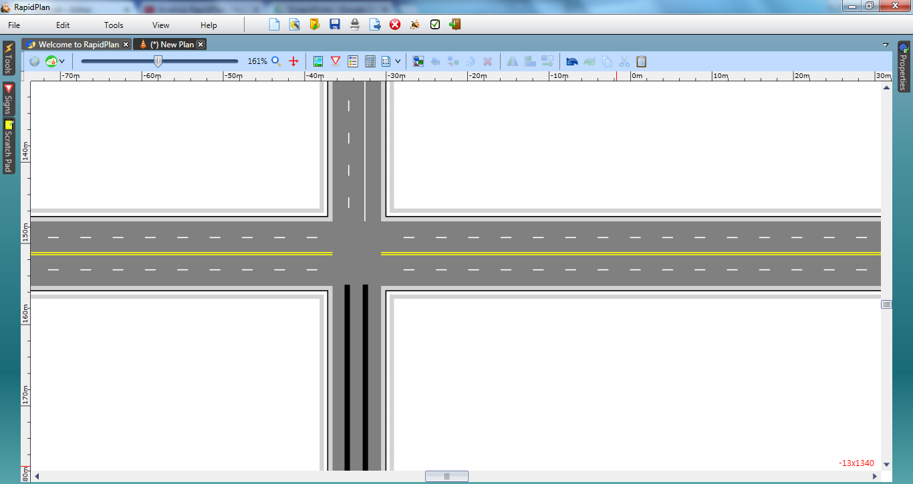

## Set the Lane Markings 

3. Double click on the east-west road. Select the Lane Markings tab and set marker number 2 to type double. Leave the double lines yellow and change the dashed lanes to white.
4. For the north-south road, set marker number 2 to solid. Change both these lanes to white.
5. Using the **Lane Mask** tool from the Markings tab, mask out each of the lines through the intersection.
6. As we will need to completely change the road markings on the southbound approach, mask them out as well.

    

7. Using the **Lane Marker** tool, draw two new lane markings to replace the ones masked out on the southern approach. They will be drawn as type solid color yellow by default. Double click on them and change their type so that they appear as  below.

    