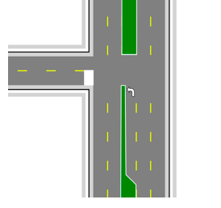

## Divided Roads 
There are two ways to make divided roadways. The first method is simply to draw another carriageway next to your first. The second method, which we will describe is more powerful.

|Divided Roads                                     |                    |
|--------------------------------------------------|--------------------|
|{no-label}  | **This Divided Roads makes use if the following items:**  - Road tool   - Lane Marker tool   - Lane Mask tool   - Rectangle tool   - Polygon tool   - Furniture from Signs Palette  |
