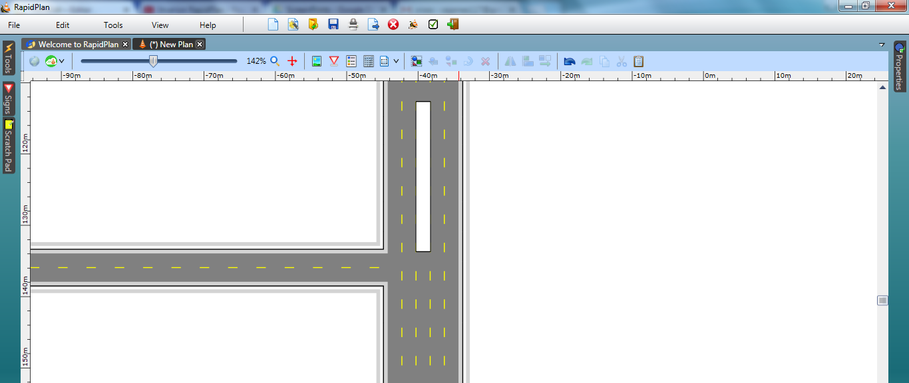

## Create the Median Strips 

3. Select the **Rectangle** tool from the Shapes tab in the Tools Palette and draw a rectangle over the center lane as shown.

    

4. Now select the Polygon tool from the Shapes tab and trace out the median as shown.

    

5. Double click each of the medians, and change their line width to 2 color white and fill to green. This makes our medians look like they are grassed.
6. Using the Lane Mask tool from the Road Tools tab, mask out the unneeded lane lines running through the intersection.

    