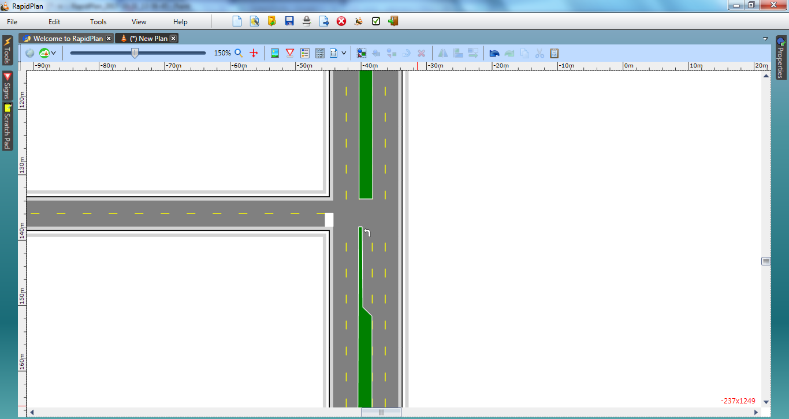

## Adding the Stop Bar and Turning Arrow

7. Select the Left turn arrow from the Furniture tab of the Signs palette and position it in the turning lane.
8. Finally, add a stop bar to the side road with the rectangle.

    
