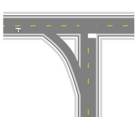

## Slip Lanes 

One of the most important skills in RapidPlan is learning to make slip lanes. Fortunately, they are very simple to do.

|Slip lane                                     |             |
|----------------------------------------------|-------------|
|  | **This T-intersection with a Slip Lane makes use if the following items:** - Road tool  - Lane Mask tool  - Rectangle tool  - Control Points  - Furniture from Signs Palette    |
