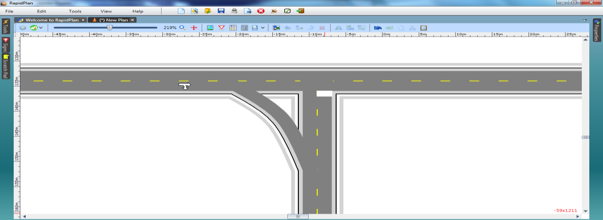

## Create the Slip Lane 

2. Select the **Turn Lane** tool from the Roads tab and create a diagonal road as shown below.

    

3. Move half way along the Turn Lane, right click and select **Insert control point**. Move the control point to shape the road to a fluid curve as shown.

    

4. Add any necessary pavement markings.

    