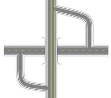

## Overpasses and Underpasses 

Whilst being one of the least frequently created arrangements, understanding how bridges and underpasses are constructed is important because it demonstrates how ordering roads on the canvas can be used to achieve certain effects.

|Overpasses and Underpasses                                     |             |
|---------------------------------------------------------------|-------------|
|{no-label}  | **This Overpasses Plan makes use if the following items:** - Road tool  - Ordering Canvas Objects  - Polyline tool  - Control Points  - Layers               |
