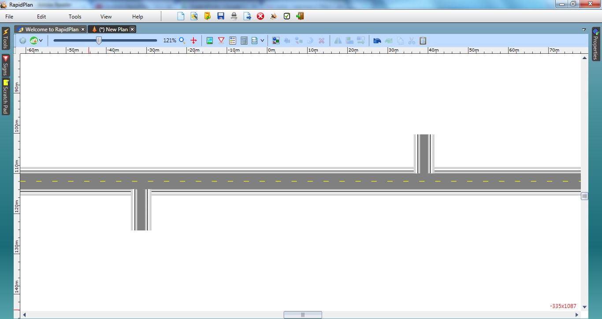

## Create the Base Road

1. Select the **Road** tool from the Roads tab and create an east-west road of 2 lanes.
2. Add 2 north-south extended lanes either end of the road. Make these one lane.

    