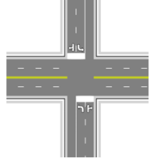
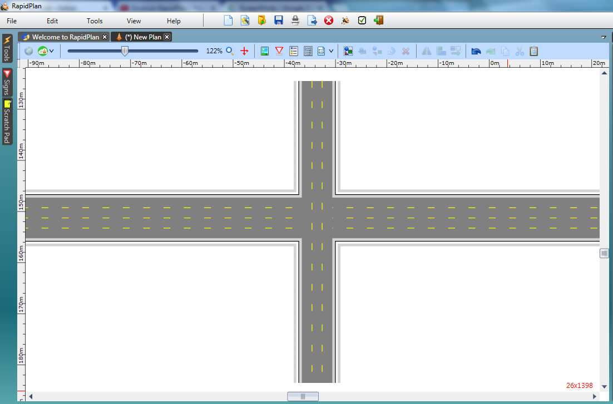
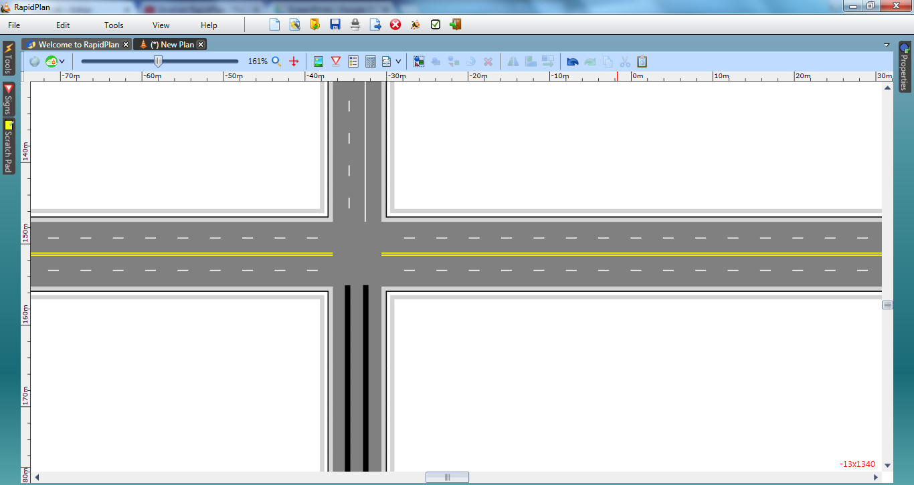
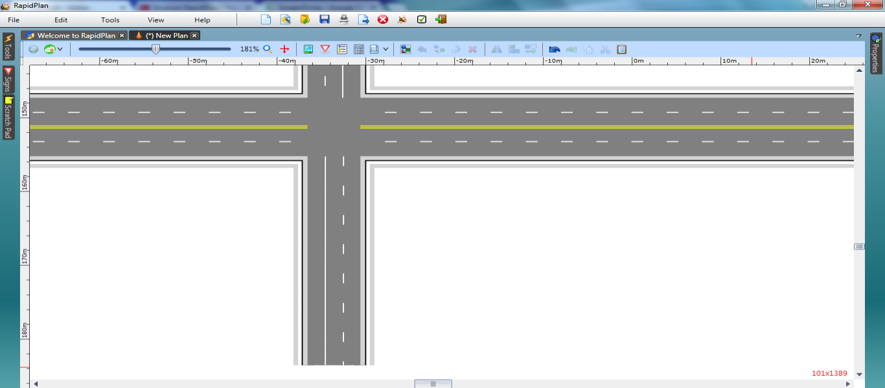
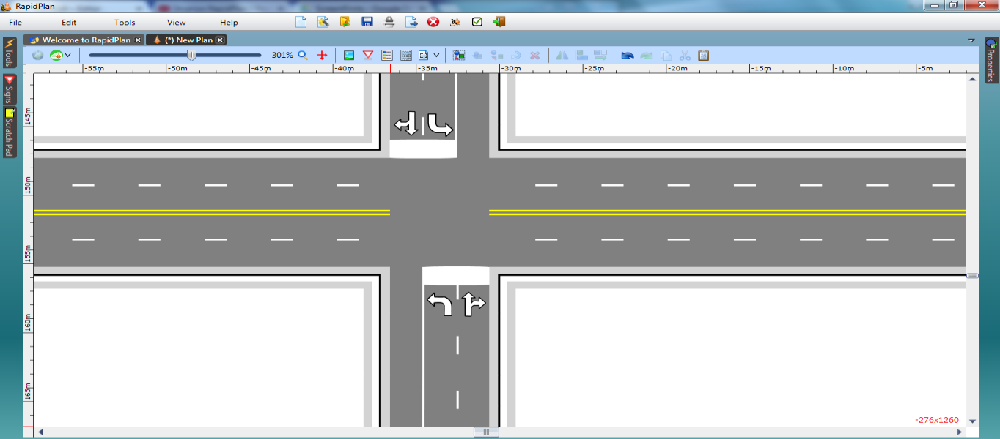

---

sidebar_position: 3

---
# Crossroads

Crossroads are similar to T-Intersections in many regards. Our simple crossroad will be a 4-lane east-west and 3-lane north-south junction.

|Crossroad intersection                                     |             |
|-----------------------------------------------------------|-------------|
|{no-label}  | **This simple Crossroad intersection makes use if the following items:** - Road tool  - Lane Marker tool  - Lane Mask tool  - Rectangle tool  - Furniture from Signs Palette  |

## Create the Base Roads

1. Select the Road tool from the Road Tools tab and draw an east west road. Change it to four lanes
2. With the Road tool already in use, draw a north south road that intersects the 4-lane road and change it to a 3-lane road as shown.

    
    
## Set the Lane Markings 

3. Double click on the east-west road. Select the Lane Markings tab and set marker number 2 to type double. Leave the double lines yellow and change the dashed lanes to white.
4. For the north-south road, set marker number 2 to solid. Change both these lanes to white.
5. Using the **Lane Mask** tool from the Markings tab, mask out each of the lines through the intersection.
6. As we will need to completely change the road markings on the southbound approach, mask them out as well.

    

7. Using the **Lane Marker** tool, draw two new lane markings to replace the ones masked out on the southern approach. They will be drawn as type solid color yellow by default. Double click on them and change their type so that they appear as  below.

    
    
## Adding the Stop Bar and Turning Arrows

8. Using the **Rectangle** tool in the Shapes tab, create stop bars in the appropriate places. Ensure that your rectangle stroke color is white (it will be black by default).
9. Select a **Left turn** or **straight arrow** from the Furniture tab of the Signs Palette and place it on the plan somewhere. Ensure it is selected, then flip it using the flip horizontal button on the Flip toolbar. Drag it into one of the two required places.
10. Duplicate your modified arrow. Drag the duplicate onto the other side of the intersection as shown.
11. Now select a Left turn arrow and place it in both required places. Make sure you flip it accordingly.

    
