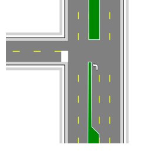
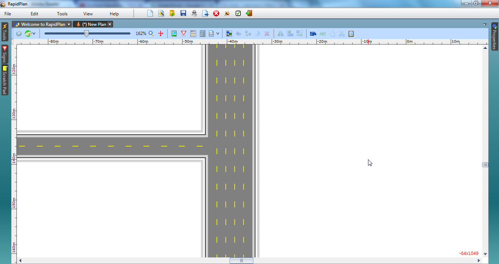
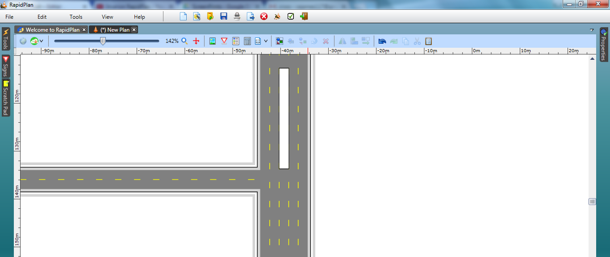
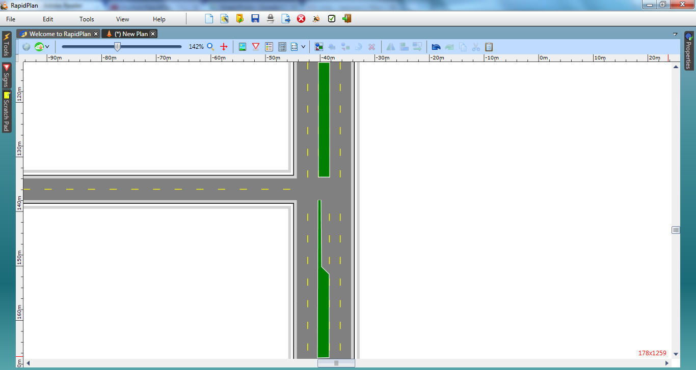
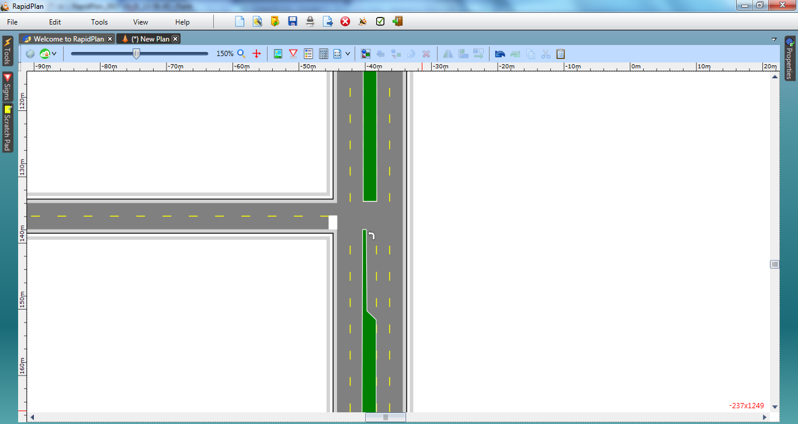

---

sidebar_position: 4

---
# Divided Roads 
There are two ways to make divided roadways. The first method is simply to draw another carriageway next to your first. The second method, which we will describe is more powerful.

|Divided Roads                                     |                    |
|--------------------------------------------------|--------------------|
| | **This Divided Roads makes use if the following items:** - Road tool  - Lane Marker tool  - Lane Mask tool  - Rectangle tool  - Polygon tool  - Furniture from Signs Palette  |

## Create the Base Roads

1. Select the **Road** tool from the Roads tab and create a north-south road of 5 lanes. There will be 2 lanes in each direction (total 4) plus the 5th to act as the median strip.
2. With the Road tool still selected, create a 2-lane road to form a T intersection and extend as shown below.

    

## Create the Median Strips 

3. Select the **Rectangle** tool from the Shapes tab in the Tools Palette and draw a rectangle over the center lane as shown.

   

4. Now select the Polygon tool from the Shapes tab and trace out the median as shown.

   

5. Double click each of the medians, and change their line width to 2 color white and fill to green. This makes our medians look like they are grassed.

6. Using the Lane Mask tool from the Road Tools tab, mask out the unneeded lane lines running through the intersection.

   
   
## Adding the Stop Bar and Turning Arrow

7. Select the Left turn arrow from the Furniture tab of the Signs palette and position it in the turning lane.

8. Finally, add a stop bar to the side road with the rectangle.

   