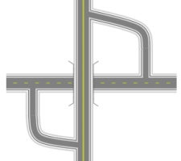
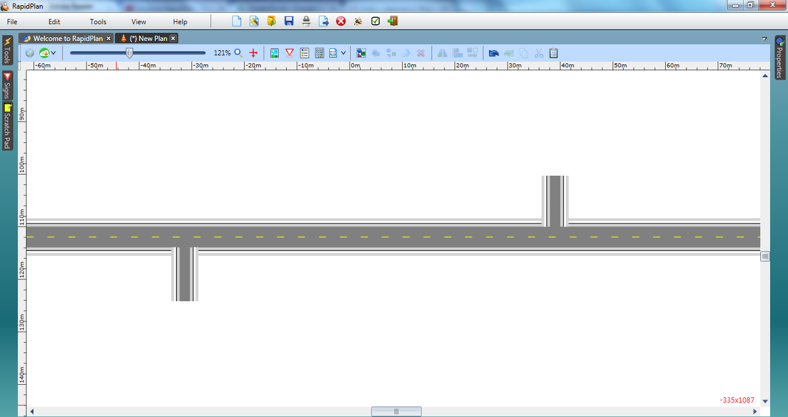
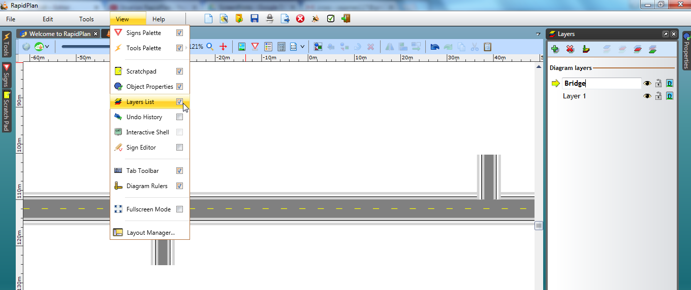
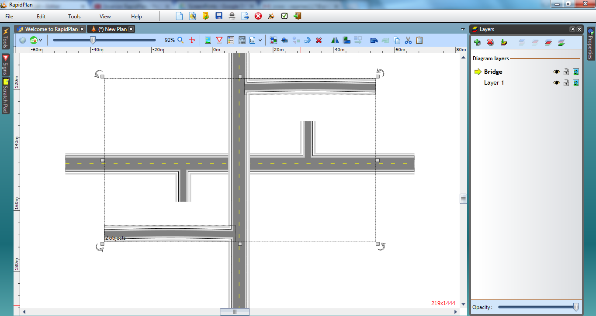
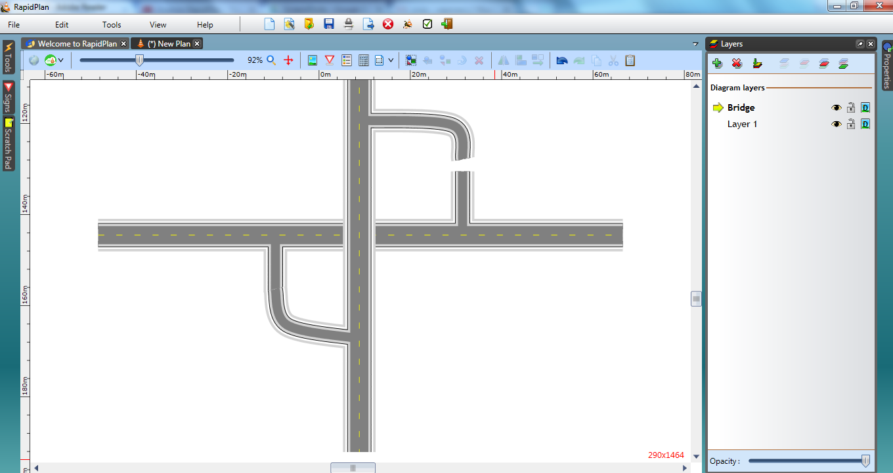
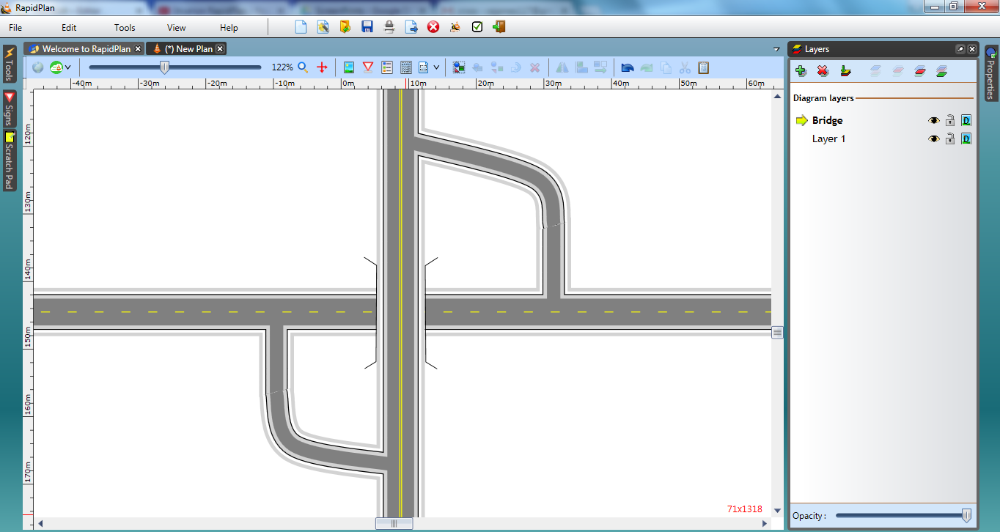

---

sidebar_position: 6

---
# Overpasses and Underpasses 

Whilst being one of the least frequently created arrangements, understanding how bridges and underpasses are constructed is important because it demonstrates how ordering roads on the canvas can be used to achieve certain effects.

|Overpasses and Underpasses                                     |             |
|---------------------------------------------------------------|-------------|
|  | **This Overpasses Plan makes use if the following items:** - Road tool  - Ordering Canvas Objects  - Polyline tool  - Control Points  - Layers               |

## Create the Base Road

1. Select the **Road** tool from the Roads tab and create an east-west road of 2 lanes.

2. Add 2 north-south extended lanes either end of the road. Make these one lane.

   

## Create the Next Road using Layers 

3. Go to **View** from the status tool bar and tick the check box next to Layers List. The Layers Palette will now be visible beneath the Properties palette. Add a new layer and name it Bridge as shown.

   

4. Now stay on the **Bridge** layer and draw a 2-lane road that runs north south between the extended roads drawn in step 2.

5. Add two roads, convert them to single lanes and add 1 control point half way along each of the new side roads as shown.

   

6. Using the two control points on the side roads, shape them both down until they meet neatly with the side entrances to the east-west road. We have left a gap in the top one so that you can see how we have done it.

   

7. Double click the bridge road and change the lane markings to double.

## Drawing in Bridge Rails

1. Using the **Polyline** tool from the Lines tab, draw in the bridge rails.

   

