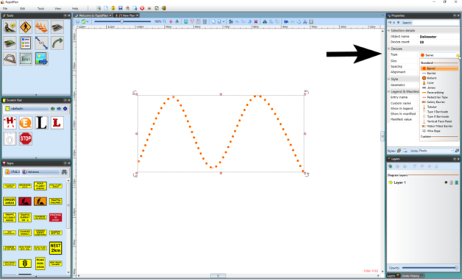

## Changing the Type of your Delineator

Once your line is on the plan, you can change the type of delineator that you use from the list on the previous page.

**To change delineator types:**

 - Select the delineator line on the plan and observe the Properties Palette.
 - Click on the Devices tab and choose the type of delineator required from the Type drop down box.

    
