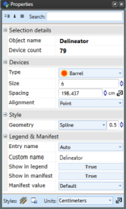

## Changing the Properties for the Delineator

As always, more in depth editing is done via the Properties palette. The following properties can be edited for each delineator:

**Devices** - Type, Size, Spacing, Alignment

**Style** > **Geometry** - Line, Spline, Bezier

